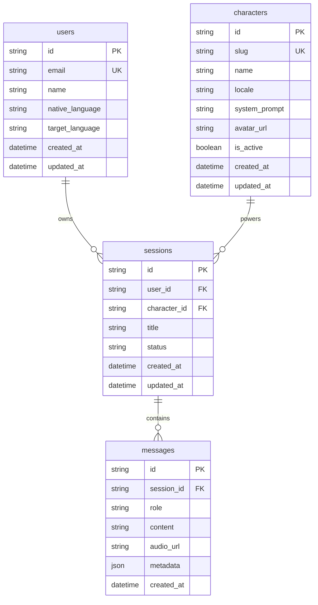

# LinguaAI Database ERD

This ERD covers the initial PostgreSQL schema for TICKET-002.

## Relationships

- One user can own many sessions.
- One character can be used by many sessions.
- One session contains many messages.
- Deleting a user cascades to their sessions and messages.
- Deleting a session cascades to its messages.
- Deleting a character is restricted while sessions reference it.

## Indexes

- `users.email` unique index for login/profile lookup.
- `characters.slug` unique index for route/API lookup.
- `sessions.user_id` for user history queries.
- `sessions.character_id` for analytics by character.
- `sessions.status` for active/archive filtering.
- `messages.session_id, messages.created_at` for ordered conversation loading.
